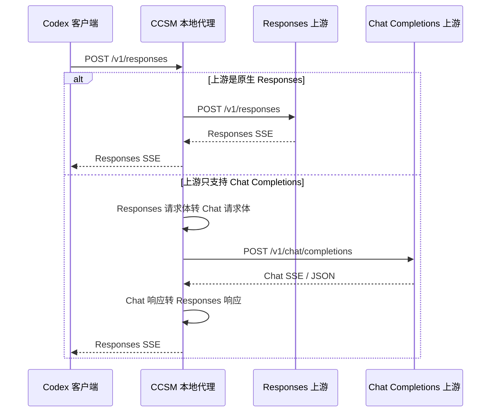
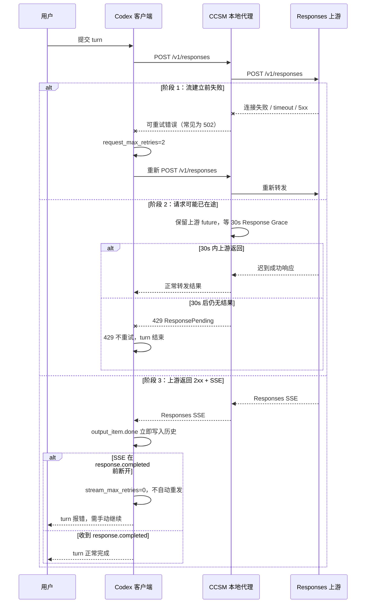
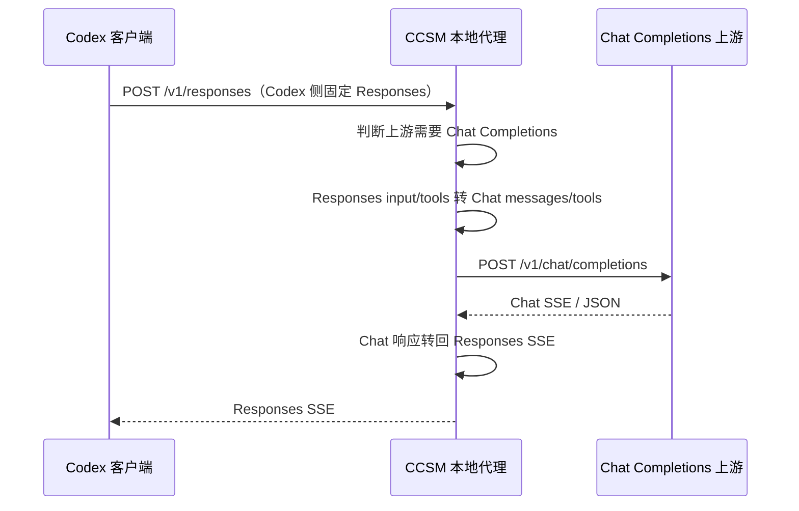
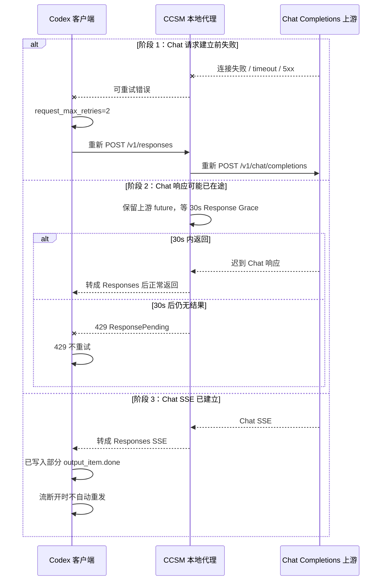

# 更完善的重连机制

> 本文档描述 **Auto Failover 关闭**时的重连机制，不含故障转移队列、熔断器或切换其它 Provider/Route 的行为。这里只说明“同一个 Provider、同一个请求链路”如何尽量恢复。

## 1. 范围与前提

当前 CCSM 托管 Codex Provider 的重试配置是：

| 项目 | 值 | 作用 |
| --- | --- | --- |
| `request_max_retries` | `2` | Codex 在 HTTP 流建立前最多再重试 2 次 |
| `stream_max_retries` | `0` | SSE 流建立后不自动重发整轮采样请求 |
| `non_streaming_timeout` | 默认 `600s` | Auto Failover 关闭时作为首个 SSE 字节的硬上限 |
| `streaming_idle_timeout` | 默认 `120s` | SSE 已建立后连续没有数据块的静默超时 |
| Auto Failover | 关闭 | CCSM 只尝试一个 Provider / Route，不切换模型 |
| Response Grace | `30s` | 可能已在途的请求，超时后继续保留上游 future 等 30 秒 |

重连原则只有一句话：

> **只重试“确认还没发出”或“还能等到结果”的阶段；一旦部分内容已经进入 Codex 历史，就不再自动重放整轮请求。**

## 2. 协议全景

注意：当前 Codex 客户端本身已经统一使用 `/v1/responses` 协议，`wire_api = "chat"` 已不再被 Codex 客户端直接支持。这里说的“Chat 协议 Provider”是指 **Codex 对 CCSM 说 Responses，CCSM 对上游说 Chat Completions**。

## 3. 完整重连时序（Responses 上游）

### 阶段说明

**阶段 1：流建立前失败，可重试。**

Codex 还没拿到 2xx，也没有收到任何 `output_item.done`，此时重新发一次是安全的。CCSM 把连接错误按 502/可重试错误返回后，Codex 的 `request_max_retries=2` 会重新发请求。

**阶段 2：请求可能已在途，不重发，只等待。**

CCSM 无法确认上游是否已经开始处理，所以不会立刻重发，而是把原来的上游 future 保留下来。常规超时后继续等 30 秒；如果上游结果只是迟到，就正常交付；如果 30 秒后仍没有结果，才返回 429。Codex 对 429 不重试，避免重复执行。

**阶段 3：SSE 已建立，不自动重连。**

Codex 在收到 `response.output_item.done` 时会立即把该 item 写入历史，而流重试会用 `clone_history()` 重建下一次请求。一旦流在 `response.completed` 前断开，自动重发就会把半截消息或已经执行过的工具调用再次放进 prompt，因此 `stream_max_retries=0`。

如果 SSE 已建立但长时间没有数据，CCSM 的 `streaming_idle_timeout` 会关闭这条流。此时响应头已经给过 Codex，CCSM 无法再把它变成可重试的 502/429；Codex 只能按“流在 `response.completed` 前结束”处理，同样不自动重发。

## 4. Chat Completions 上游的完整链路

这条链路的重连规则与 Responses 上游相同，失败分支仍然是：

### Chat 协议的特殊点

1. **转换发生在 CCSM 内。**
   Codex 看到的始终是 `/v1/responses`；只有出站请求被改成 `/v1/chat/completions`。

2. **响应也要转回来。**
   上游返回 Chat SSE 或 JSON，CCSM 会转换成 Responses SSE 再交给 Codex，所以 Codex 的 `response.completed` 语义不变。

3. **响应头不可靠时仍要按请求流标志识别。**
   部分上游不返回 `content-type: text/event-stream`，但 body 实际是 SSE。CCSM 使用“请求 `stream=true` + 非 JSON 响应”作为兜底判断，避免把流式响应整包缓冲后误判成 body 读取失败。

4. **Codex 自身没有单独的 Chat 重连层。**
   因为 Codex 侧永远是 Responses，所以 Chat 上游的恢复仍然由 Codex `request_max_retries`、CCSM Response Grace 和 `stream_max_retries=0` 共同决定。

## 5. 关键边界总结

| 故障窗口 | 是否重连 | 谁负责 | 结果 |
| --- | --- | --- | --- |
| 流建立前连接/5xx 失败 | 是 | Codex `request_max_retries=2` | 重新 POST 同一请求 |
| 上游可能已在途 | 否，等待 | CCSM `response_grace=30s` | 迟到结果正常交付；否则 429 |
| 429 ResponsePending | 否 | Codex `retry_429=false` | turn 结束，不自动重发 |
| SSE 已建立、未收到 completed | 否 | Codex `stream_max_retries=0` | turn 报错，避免重复历史 |
| `output_item.done` 已写入 | 否 | Codex 当前实现 | 自动重试会把半截 item 再带入 prompt |

## 6. 为什么不能简单调大 `stream_max_retries`

原因是 Codex 当前的持久化时机：

- `response.output_item.done` 到达时，Codex 立即调用 `record_conversation_items()` 写入历史。
- 流级重试时，Codex 用 `sess.clone_history()` 重新构造 prompt。
- 因此只要断流发生在任意 item done 之后，重试请求就会包含之前的部分消息、工具调用或工具结果。

调大 `stream_max_retries` 看起来能“自动恢复”，实际上会带来重复文本、重复工具调用和污染后的会话历史。要放开这层重试，需要 Codex 先实现“未收到 `response.completed` 就不持久化”或“重试前回滚已写 item”。

## 7. 相关源码位置

- Codex request retry：`codex-client/src/retry.rs`
- Codex stream retry：`codex-rs/core/src/session/turn.rs`
- Codex 立即持久化 item：`codex-rs/core/src/stream_events_utils.rs`
- CCSM 托管 retry 配置：`cc-switch/src-tauri/src/codex_config.rs`
- CCSM failover 关闭时的超时策略：`cc-switch/src-tauri/src/proxy/handler_context.rs`
- CCSM Response Grace：`cc-switch/src-tauri/src/proxy/response_grace.rs`
- CCSM 流式响应识别：`cc-switch/src-tauri/src/proxy/response_processor.rs`
- CCSM Responses→Chat 转换：`cc-switch/src-tauri/src/proxy/forwarder.rs`、`cc-switch/src-tauri/src/proxy/providers/codex.rs`
