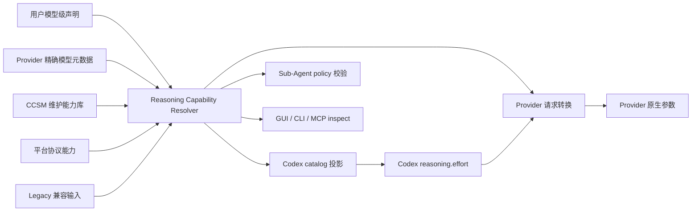
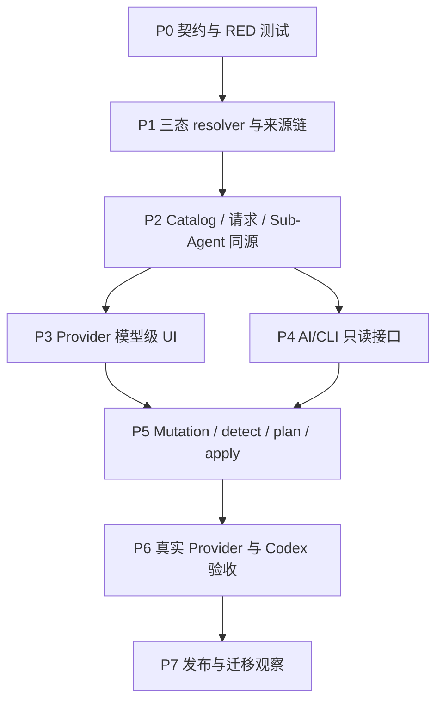

# Codex 第三方模型推理能力修正实施计划

## 1. 目标与边界

本计划把
`docs/superpowers/specs/2026-08-13-codex-preset-reasoning-capabilities-design.md`
推进为可实施、可追踪、可验收的工作包。

目标：Provider、CCSM、Codex、主 Agent 与 Sub-Agent 对同一个最终模型使用同一份推理能力事实，
并让 GUI、CLI、配置文件和未来本地 MCP 通过同一 Application Service 安全修改它。

本计划不处理 reasoning 内容展示、跨 Provider reasoning 历史回放或 vLLM SSE 事件兼容；这些属于
已有 portable reasoning / replay 设计。这里仅处理“支持什么、用户选什么、最终发送什么”。

## 2. 当前基线

| 能力 | 当前状态 | 本计划动作 |
| --- | --- | --- |
| Rust effort 枚举 | 已含 `none/minimal/low/medium/high/xhigh/max/ultra` | 保留并统一公开 schema |
| 模型 capability | 已有 `CodexModelReasoningCapability`，仍以 `supported: bool` 为主 | 兼容迁移到三态与控制类型 |
| 统一解析结果 | 已有 `ResolvedSubagentReasoningCapability` | 扩展来源、时间、revision、诊断 |
| Codex catalog 投影 | 已接入 resolver，但兼容入口较多 | 完整审计并建立契约快照 |
| 请求转换 | 已有 capability-aware 映射 | 禁止 unknown/none 的隐式厂商转换 |
| Sub-Agent | schema v2 已有四种运行策略 | 收紧 unknown 新配置，隔离 legacy |
| Provider UI | 已有模型级结构化编辑基础 | 增加三态、来源、检测与最终投影 |
| AI/CLI | 尚无正式 reasoning 命令 | 分两阶段加入只读与 mutation |

## 3. 最终数据流



核心门禁：`C`、`T`、`S`、`V` 必须携带同一个 capability fingerprint。任何一层重新按模型名
猜测档位，都视为实现失败。

## 4. 实施路线图



| 阶段 | 可见交付物 | 进入条件 | 完成门禁 |
| --- | --- | --- | --- |
| P0 | schema、fixture、失败测试、能力指纹格式 | 设计批准 | RED 能分别锁定 unknown、空数组、none 和 legacy |
| P1 | 单一 resolver、Provider metadata adapter、维护库 | P0 | 所有来源优先级和失败降级测试通过 |
| P2 | catalog/request/Sub-Agent 同源投影 | P1 | 同一模型四层 fingerprint 一致 |
| P3 | 模型编辑器最终生效视图 | P2 | 用户无需编辑 JSON 即可完成安全配置 |
| P4 | `inspect/list/validate/export` JSON 接口 | P2 | AI 可只读诊断且输出完全脱敏 |
| P5 | `detect/plan/apply/reset` | P3、P4 | dry-run 等价、revision 冲突、回读和幂等通过 |
| P6 | Qwen/vLLM、DeepSeek、OpenAI、unknown canary | P5 | Codex 菜单、请求、Sub-Agent 与上游日志一致 |
| P7 | 迁移报告、release note、回滚说明 | P6 | 安装态验证，不以源码测试代替 |

## 5. 工作包

### P0：冻结契约并先写失败测试

涉及：

- `src/types.ts`
- `src-tauri/src/proxy/providers/codex_reasoning.rs`
- `src-tauri/src/codex_config.rs`
- `src-tauri/src/codex_subagent_profiles.rs`
- 对应 React/Rust 测试

动作：

1. 为持久化 schema 增加 `schemaVersion`、`supportStatus`、`controlKind`；继续读取旧
   `supported: bool`，新写入只使用新 schema。
2. 明确区分：字段缺失、`unknown`、`confirmed_unsupported`、明确 `supportedEfforts=[]`。
3. 定义稳定 `capabilityFingerprint`：只覆盖影响运行的规范化字段，不包含 `fetchedAt` 等易变元数据。
4. RED 覆盖：unknown 不继承 GPT 档位；空数组不被模板补齐；无关闭契约时 `none` 不变成 false；
   新 fixed 不能借 legacy 通道绕过校验。

### P1：统一来源链和常用模型能力库

建议新增：

- `src-tauri/src/reasoning_capabilities/mod.rs`
- `src-tauri/src/reasoning_capabilities/catalog.rs`
- `src-tauri/src/reasoning_capabilities/provider_metadata.rs`

动作：

1. 将现有 resolver 演进为唯一入口，不在 UI、catalog 或请求转换中增加第二个 switch。
2. Provider metadata adapter 返回 `Found / NotAdvertised / Unavailable / Invalid`，其中后三者均不能
   自动生成 `confirmed_unsupported`。
3. 维护库以“平台 + API 格式 + canonical model + revision range”匹配，并记录来源 URL、核验日期、
   CCSM 版本和证据等级；运行时不依赖联网。
4. 动态探测只进入带 TTL 的候选缓存。用户点击采用后才产生 `source=user_confirmed_detection` 的覆盖。
5. 聚合平台协议声明优先于模型原厂通用声明，但用户模型级覆盖始终最高。

### P2：四个消费者改为同源

消费者：

1. Codex JSON catalog / Desktop aliases / inline TOML；
2. Responses → Chat/Anthropic/Provider-native 请求转换；
3. Sub-Agent capability API、profile compiler 和角色 TOML；
4. GUI/CLI inspect 输出。

动作：

- 删除或封闭每个消费者内部的通用 GPT reasoning fallback；
- 每个投影携带 fingerprint 和 source summary；
- catalog 接受的值必须是 `codexSelectableEfforts`；请求转换目标必须在
  `providerAcceptedEfforts`；
- `none` 先按 disable capability 处理，不能作为普通正向 effort 映射；
- MultiRouter 必须在 route model map 后，用 effective Provider + upstream model 解析。

### P3：结构化 UI 与可见诊断

唯一普通入口继续为：

```text
Provider 编辑 → 模型列表 → 编辑模型 → 推理能力
```

模型卡片显示：状态、控制类型、能力来源、核验时间、Provider 原生档位、Codex 可选档位、默认值、
关闭能力、映射和最终行为。unknown 状态默认显示“使用服务端默认”，同时提供：

- 重新检测；
- 采用检测结果；
- 选择维护模板；
- 手动声明；
- 恢复内置值。

Sub-Agent 页面只消费后端 resolved 结果，并显示最终控制来源。unknown 只推荐 `delegated`；新建
`fixed` 前必须先完成模型能力声明。

### P4：AI/CLI 只读面

先交付无风险查询：

```text
ccsm reasoning list
ccsm reasoning inspect --provider <id> --model <id> --output json
ccsm reasoning validate --provider <id> --output json
ccsm reasoning export --provider <id> --redacted --output json
```

响应统一包含：`schemaVersion/requestId/revision/persisted/resolved/codexProjection/
providerProjection/diagnostics`。stdout 只放数据，stderr 放诊断；密钥和 reasoning 正文永不输出。

P4 先以 CLI transport 接入共享 Application Service。未来 MCP 只包装相同方法，并通过
`readOnlyHint/destructiveHint/idempotentHint` 改善客户端 UX；这些 annotation 只是提示，安全边界
仍由后端权限、plan/apply 分离和 revision 校验保证。

### P5：AI/CLI 写入面

```text
ccsm reasoning detect --provider <id> --model <id>
ccsm reasoning plan --file <declaration.json>
ccsm reasoning apply --file <declaration.json> --expected-revision <n>
ccsm reasoning reset --provider <id> --model <id> --expected-revision <n>
```

必须满足：

- `detect` 默认零持久化副作用；
- `plan` 和 `apply` 调用同一校验与规范化函数；
- 写入使用乐观并发与幂等目标状态；
- mutation 完成数据库写入、派生产物刷新、文件回读和 resolver 回读后才返回成功；
- 失败恢复原声明与派生产物，并返回不含敏感数据的 rollback 结果；
- AI 无权把无证据猜测标记为 Provider authoritative，手工声明固定为 `source=user`。

### P6：真实验收矩阵

| 场景 | Catalog/UI | Codex 请求 | Provider 上游 | Sub-Agent |
| --- | --- | --- | --- | --- |
| Qwen/vLLM 无档位元数据 | unknown、无虚假菜单 | 不注入 effort | 不把 none 转 false | delegated 可运行 |
| Qwen/vLLM 用户确认 low/high | 只显示 low/high | 只接受 low/high | 按声明字段映射 | fixed high 可运行 |
| DeepSeek 维护能力 | low/high/max，默认 high | 合法别名才可选 | 显式映射到原生值 | 四策略逐项验证 |
| OpenAI 官方模型 | 官方 catalog | 原生 Responses | 不经第三方翻译 | 目标模型集合校验 |
| unknown 自定义网关 | 服务端默认 | 省略 effort | 不猜测 | fixed 被阻止并引导声明 |

每个场景保存同一 trace 的：resolved fingerprint、Codex model list、实际请求 JSON 的脱敏结构、
Provider 接收结果、角色 TOML 和子任务最终 effort。不得只凭 UI 截图或单元测试验收。

### P7：迁移、发布与回滚

1. 旧 `supported`、`codexChatReasoning` 和 schema-v1 Sub-Agent 值只读迁移，至少保留一个稳定周期。
2. 首次升级生成迁移报告，不把 legacy 推断固化为 authoritative。
3. 先发布 read-only/diagnostic，再开放 mutation；mutation 可由 feature flag 分阶段启用。
4. release acceptance 必须覆盖安装版、运行中的 15721、Codex app-server 重启和新任务。
5. 回滚保留旧 schema 字段读取能力；新 schema 在旧版不可安全读取时，升级前生成可恢复备份。

## 6. 提交与验收节奏

每个阶段至少拆成 RED、GREEN、集成/文档三个独立提交。每个提交只承担一个可验证结论，说明根因、
测试和影响范围，并以仓库要求的署名结尾。P0 至 P5 不改版本号；只有 P6 安装验收通过后才进入
release 决策。

## 7. 当前未决问题

1. Provider 动态能力元数据的首批 adapter：OpenRouter、vLLM 扩展接口还是其他平台；需按真实接口
   证据排序，不能为了“自动”而伪造通用探测。
2. 常用模型能力库采用编译期 Rust 数据还是版本化 JSON 资源；无论选择哪种，前端不得维护副本。
3. CLI 是主程序子命令还是独立 `ccsm` 二进制；应由全局 AI Configuration Plane 设计统一决定。
4. MCP server 和可选本地 HTTP API 的交付顺序由全局设计决定；reasoning 不单独开监听端口。

在这些问题确定前，可以先执行 P0、P1 的契约和 resolver 工作；但不得提前实现未经证实的动态
Provider adapter。
